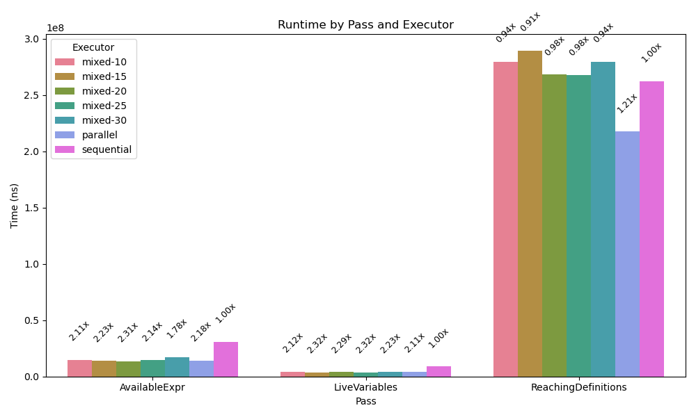
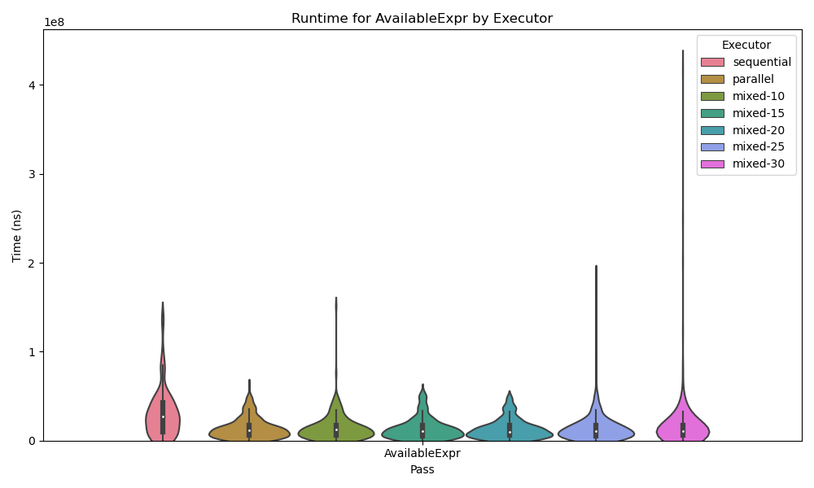
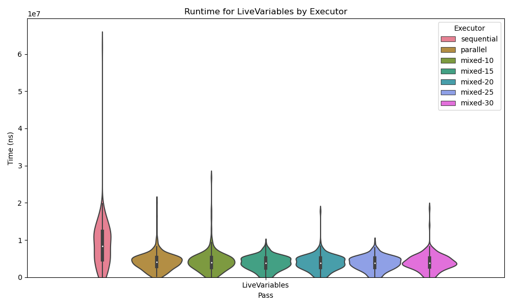
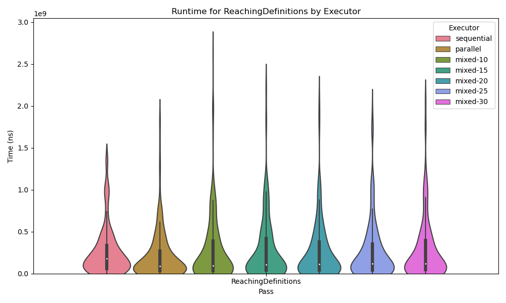
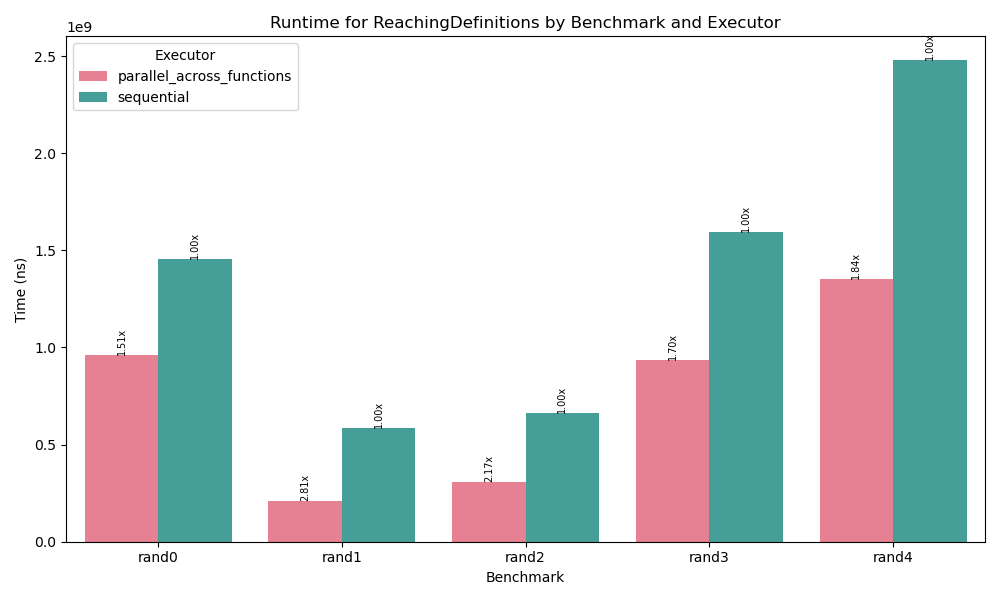
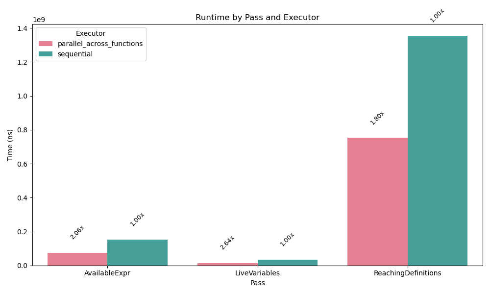

+++
title = "Parallelizing Dataflow Analyses"
[extra]
bio = """
  Our project explores the benefit of parallelizing a dataflow analysis for a single CFG. 
"""
latex=true
[[extra.authors]]
name = "Parth Sarkar"
[[extra.authors]]
name = "Edmund Lam"
[[extra.authors]]
name = "Ethan Gabizon"

# Motivation
Dataflow analyses can be a bottleneck in performance for just-in-time (JIT) compilers, limiting the optimizations that they can perform.

We identified dataflow analysis as a good candidate for parallelization because it uses the iterative worklist algorithm. Given a CFG, an initial value `init`, and `merge` and `transfer` functions, the algorithm is as follows:
```
in[entry] = init
out[*] = init

worklist = all blocks
while worklist is not empty:
  b = pick any block from worklist
  in[b] = merge(out[p] for every pred p of b)
  out[b] = transfer(b, in[b])
  if out[b] changed:
    worklist += successors of b
```
At a high level, our idea is to let multiple threads process different blocks of the CFG at once. 


# Implementation
All of our implementations are written in Rust and operate on Bril programs.

## Sequential
Our sequential algorithm is a straightforward implementation of the pseudocode given above.

## Parallel
The naive parallel algorithm we implemented repeatedly batches entire worklist calls to a threadpool using [rayon](https://docs.rs/rayon/latest/rayon/). Each thread returns its new output values as well as whether they were modified. After each batch call, the set of unique basic blocks that need updating is collected from this information, and sent out as a new batch call. This is therefore bottlenecked by the sequential collection and assembly of both the new worklist and the new out values. 

## Mixed
During testing and early evaluations, we found that some benchmarks are too small to benefit from parallelization. This is likely because the amount of time required to execute the worklist algorithm is less than the amount of time it takes to spawn and collect threads. We attempted to find a heuristic, based on the size of a function in basic blocks, that we can use for switching between our sequential and parallel versions of the algorithm.  

This version of the algorithm takes an integer threshold as an additional input; if the size of the function is below that threshold it uses the sequential algorithm and otherwise it uses the parallel algorithm.

## Parallel Across Functions
We also implemented another type of algorithm which parallelizes dataflow analysis across functions. In a Bril file with 4 functions, this algorithm will assign a CFG to 4 threads and achieve parallelism that way. This implementation is likely more useful in an ahead of time compiler rather than a JIT, but we thought it would interesting to explore what kind of speedups we can achieve with a different parallelism scheme.

## Code Organization
To make our code less dependent on the specific implementation of the worklist algorithm (i.e. parallel, sequential, mixed, etc.), our code has a flexible trait system. First, we have a trait called `DataflowExecutor`, parameterized on a generic type `Pass`. Given an implementation of the function `cfg`, which runs a worklist algorithm dictated by `Pass` on a control-flow graph `CFG` object, `DataflowExecutor` provides the function `run` that will run dataflow on all functions within a Bril program and concatenate the results for emission to `stdout`.

Here, `Pass` is meant to be a generic type representing the kinds of analyses a compiler might use: reaching definitions, constant propagation, liveness analysis, etc. Hence, an element in `Pass` must implement the framework we learned in class, here encoded as a trait called `DataflowSpec`. This interface requires its objects to implement a `init`, `meet`, and `transfer` functions.

Finally, because every worklist implementation must use this same trait, we required both `DataflowExecutor` and `Pass` to implement `Send + Sync`, which allows objects and their references to be transferrable across threads.

# Testing
For correctness testing, we implemented a textual output for each of our dataflow analyses. Then, for each parallel algorithm we checked that its output matches the sequential output for all of the tests in the Bril core benchmarks, and our randomly generated Bril programs. We were confident our sequential algorithm was correct and were mainly concerned with bugs arising from parallelization.

# Evaluation
We evaluated our implementations on the Bril core benchmarks and a series of 50 randomly-generated benchmarks of varying size. In general, we found that the Bril benchmarks are probably too small (meaning many of them took < 1ms for a sequential dataflow analysis) to provide meaningful results, so we focused instead on evaluating our randomly-generated benchmark suite. 

For generating random Bril programs, we used [Bear](https://stephenverderame.github.io/blog/bear/), an existing fuzzer for Bril. 

## Parallelizing a Single CFG
We were interested in the average runtime for each pass, with each type of algorithm, across all benchmarks.
Runtime includes the amount of time it takes to build a CFG and run the worklist algorithm on it. It does not include the time to parse a Bril program.


In general, it seems our parallel algorithm provides at least some speedup over the sequential one. It also seems that our heuristics for all of our hybrid algorithms were quite bad, since at best they are on par with the fully parallel implementation. In the case of the reaching definitions analysis all of the hybrid algorithms are actually slower than the sequential one, so our heuristics were probably wrong more often than they were right. It is also possible that different heuristics are required for different types of analyses, which we did not explore.

We also were interested in evaluating our algorithms on specific benchmarks.

We examined the performance of reaching definitions, with each algorithm, on ten random benchmarks. The results are promising; at best, the parallel algorithm far outperforms the sequential one, and at worst the sequential algorithm slightly outperforms the parallel one. Out of these ten random benchmarks, sequential outperforms parallel on only one.

We present violin plots as well to show the spread of performance across our random benchmarks.
 
 


## Parallelizing Across CFGs
We also evaluated how our other parallelism scheme performs, parallelizing across functions.

These results are somewhat disappointing, and serve as a good insight as to why compilers usually aren't multithreaded. Here, each benchmark is a Bril file consisting of 4 randomly-generated Bril functions. Our implementation uses a max of 8 threads, but here only 4 get used because there are only 4 functions per file. Ideally we would expect a 4x speedup. However, the real performance falls short of that because of imbalance in the workload; the largest function in each file places an upper bound on performance. If each function in the benchmark took the same amount of time to run the worklist on, we would expect a speedup closer to 4x. In this experiment, if we get lucky we can get up to a 2.81x speedup which is pretty good, but not great considering we used 4 threads. At worst, we get a 1.5x speedup. One could imagine constructing an example for which this parallelization scheme is exceptionally bad: one really large function and a bunch of other smaller ones, so that the speedup approaches 1x (or dips below it, depending how bad the thread overhead is). 

This trend holds true across the other analyses as well. 


# Considerations Along the Way

Out of the gate, one of our biggest concerns was the correctness of the parallel version of the worklist algorithm. In particular, our experience with multithreading was limited to pre-defined, known algorithms, often containing highly independent sub-problems that could be discharged to different threads (e.g. parallel merge sort). On the other hand, the parallelization of the worklist algorithm was hard in the sense that the threads are operating on highly inter-dependent data (the `in` and `out` arrays), and there was no clear way to "divide and conquer" the problem.

This uncertainty poses two issues with respect to correctness:
- What guarantee do we have that, if the threads terminate, the `in` / `out` arrays have the right values?
- How do we know the threads won't enter deadlock?

As far as that first question, we had some intuition that the "clobbering" method would be fine. That is, any number of threads could each pull from the worklist queue and, as long as the threads each added their successors at the end, things would work out. Indeed, our correctness tests on the benchmarks suite supports this. That said, we are not sure how to prove the correctness of this method. 

Next, because our final implementation did not use any locks, we knew deadlocking wasn't an option. However, our original implementation did include locks, so we wanted to provide a brief rationale about why deadlock (probably!) wouldn't occur there either.

First, note that a deadlock probably would occur if we did not implement a `RWLock` for each `out[b]`. In the event that there were two blocks `b1` and `b2` such that blocks `p1` and `p2` are predecessors of each `b1` and `b2`, then it's possible that one thread could completely lock `out[p1]` and the other thread could lock `out[p2]`, resulting in a deadlock. So, we certainly need to be able to have unlimited read access to these fields.

So, if deadlock did occur, it would be where a thread `t1` is trying to write to `out[b]` in the line `out[b] = transfer(b, in[b])`. But, if this is a case of deadlock, there must be another thread `t2` that owns write access to `in[b]`. The only way this could happen is if there were two threads that are operating on block `b` simultaneously, which we can easily disallow. So, as long as we don't allow two different threads to perform the worklist algorithm on the same block, we can avoid deadlock!
