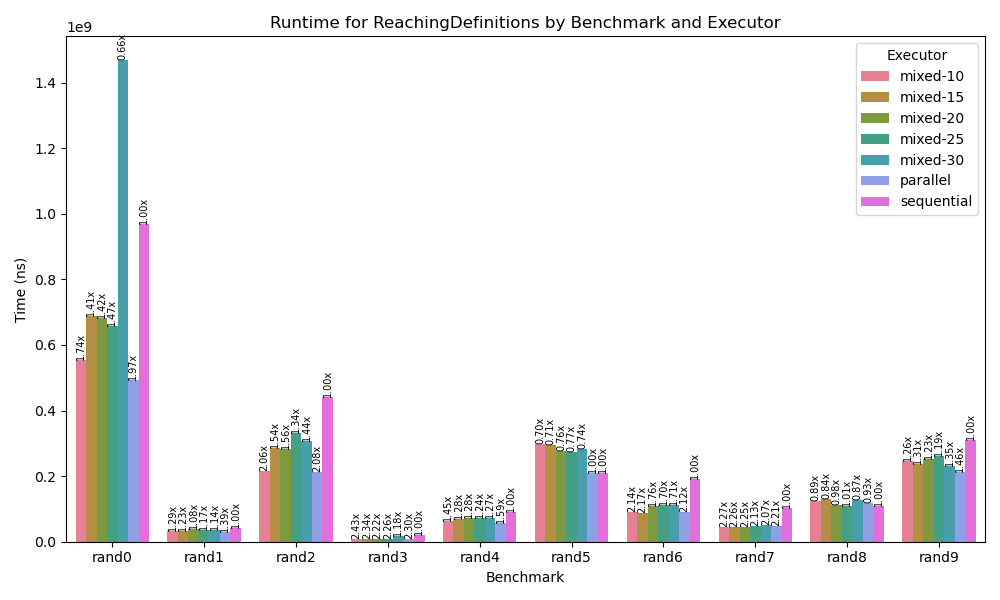

+++
title = "Parallelizing Dataflow Analyses"
[extra]
bio = """
  Our project explores the benefit of parallelizing a dataflow analysis for a single CFG. 
"""
latex=true
[[extra.authors]]
name = "Parth Sarkar"
[[extra.authors]]
name = "Edmund Lam"
[[extra.authors]]
name = "Ethan Gabizon"

# Motivation
Dataflow analyses can be a bottleneck in performance for just-in-time (JIT) compilers, limiting the optimizations that they can perform.

We identified dataflow analysis as a good candidate for parallelization because it uses the iterative worklist algorithm. Given a CFG, an initial value `init`, and `merge` and `transfer` functions, the algorithm is as follows:
```
in[entry] = init
out[*] = init

worklist = all blocks
while worklist is not empty:
  b = pick any block from worklist
  in[b] = merge(out[p] for every pred p of b)
  out[b] = transfer(b, in[b])
  if out[b] changed:
    worklist += successors of b
```
At a high level, our idea is to let multiple threads process different blocks of the CFG at once. 


# Implementation
All of our implementations are written in Rust and operate on Bril programs.

## Sequential
Our sequential algorithm is a straightforward implementation of the pseudocode given above.

## Parallel
The naive parallel algorithm we implemented repeatedly batches entire worklist calls to a threadpool using [rayon](https://docs.rs/rayon/latest/rayon/). Each thread returns its new output values as well as whether they were modified. After each batch call, the set of unique basic blocks that need updating is collected from this information, and sent out as a new batch call. This is therefore bottlenecked by the sequential collection and assembly of both the new worklist and the new out values. 

## Mixed
During testing and early evaluations, we found that some benchmarks are too small to benefit from parallelization. This is likely because the amount of time required to execute the worklist algorithm is less than the amount of time it takes to spawn and collect threads. We attempted to find a heuristic, based on the size of a function in basic blocks, that we can use for switching between our sequential and parallel versions of the algorithm.  

This version of the algorithm takes an integer threshold as an additional input; if the size of the function is below that threshold it uses the sequential algorithm and otherwise it uses the parallel algorithm.

## Parallel Across Functions
We also implemented another type of algorithm which parallelizes dataflow analysis across functions. In a Bril file with 4 functions, this algorithm will assign a CFG to 4 threads and achieve parallelism that way. This implementation is likely more useful in an ahead of time compiler rather than a JIT, but we thought it would interesting to explore what kind of speedups we can achieve with a different parallelism scheme.

# Testing
For correctness testing, we implemented a textual output for each of our dataflow analyses. Then, for each parallel algorithm we checked that its output matches the sequential output for all of the tests in the Bril core benchmarks, and our randomly generated Bril programs. We were confident our sequential algorithm was correct and were mainly concerned with bugs arising from parallelization.

# Evaluation
We evaluated our implementations on the Bril core benchmarks and a series of 50 randomly-generated benchmarks of varying size. In general, we found that the Bril benchmarks are probably too small (meaning many of them took < 1ms for a sequential dataflow analysis) to provide meaningful results, so we focused instead on evaluating our randomly-generated benchmark suite. 

For generating random Bril programs, we used [Bear](https://stephenverderame.github.io/blog/bear/), an existing fuzzer for Bril. 

## Parallelizing a Single CFG
We were interested in the average runtime for each pass, with each type of algorithm, across all benchmarks.
Runtime includes the amount of time it takes to build a CFG and run the worklist algorithm on it. It does not include the time to parse a Bril program.


In general, it seems our parallel algorithm provides at least some speedup over the sequential one. It also seems that our heuristics for all of our hybrid algorithms were quite bad, since at best they are on par with the fully parallel implementation. In the case of the reaching definitions analysis all of the hybrid algorithms are actually slower than the sequential one, so our heuristics were probably wrong more often than they were right. It is also possible that different heuristics are required for different types of analyses, which we did not explore.

We also were interested in evaluating our algorithms on specific benchmarks.

We examined the performance of reaching definitions, with each algorithm, on ten random benchmarks. The results are promising; at best, the parallel algorithm far outperforms the sequential one, and at worst the sequential algorithm slightly outperforms the parallel one. Out of these ten random benchmarks, sequential outperforms parallel on only one.

We present violin plots as well to show the spread of performance across our random benchmarks.
 
 


## Parallelizing Across CFGs
We also evaluated how our other parallelism scheme performs, parallelizing across functions.

These results are somewhat disappointing, and serve as a good insight as to why compilers usually aren't multithreaded. Here, each benchmark is a Bril file consisting of 4 randomly-generated Bril functions. Our implementation uses a max of 8 threads, but here only 4 get used because there are only 4 functions per file. Ideally we would expect a 4x speedup. However, the real performance falls short of that because of imbalance in the workload; the largest function in each file places an upper bound on performance. If each function in the benchmark took the same amount of time to run the worklist on, we would expect a speedup closer to 4x. In this experiment, if we get lucky we can get up to a 2.81x speedup which is pretty good, but not great considering we used 4 threads. At worst, we get a 1.5x speedup. One could imagine constructing an example for which this parallelization scheme is exceptionally bad: one really large function and a bunch of other smaller ones, so that the speedup approaches 1x (or dips below it, depending how bad the thread overhead is). 

This trend holds true across the other analyses as well. 
